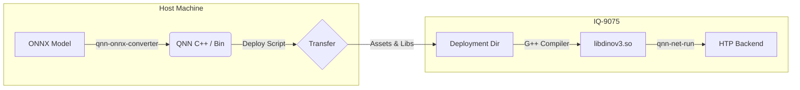

# Deployment Architecture

## System Overview

This deployment pipeline moves computation from the **Host (x86)** to the **Edge Device (IQ-9075/Snapdragon)**, utilizing the **Hexagon Tensor Processor (HTP)** for efficient inference.

## detailed Pipeline

### 1. Model Conversion (Host)
*   **Tool**: `qnn-onnx-converter`
*   **Input**: `dinov3.onnx` (Opset 17)
*   **Process**:
    *   Quantization calibration is performed using dummy input.
    *   Generates `dinov3_qnn.cpp` (Graph structure) and `dinov3_qnn.bin` (Quantized Weights).
    *   **Note**: We do NOT compile `libdinov3.so` on the host to avoid cross-compiler version issues. We transfer source and compile on-device.

### 2. Deployment (`deploy.py`)
This Python script manages the lifecycle:
*   **Smart Transfer**: Checks MD5 checksums to avoid re-uploading large SDK libraries (`libQnnHtp.so`, etc.).
*   **Asset Management**:
    *   Uploads source code (`.cpp`) and weights (`.bin`).
    *   Uploads **Hexagon Skel Libraries**: Critical step. Finds `libQnnHtp*Skel.so` in the local SDK and uploads them to the device to ensure firmware compatibility.
*   **Environment Setup**:
    *   Target: `aarch64-oe-linux-gcc11.2` (OpenEmbedded).
    *   `ADSP_LIBRARY_PATH`: Configured to prioritize our uploaded Skel libraries over system defaults.

### 3. On-Device Compilation
We use the device's native `g++` to build the model library.
*   **Command**: `g++ -shared -fPIC ... -o libdinov3.so`
*   **Advantage**: Guarantees binary compatibility with the device's C++ runtime.

### 4. Inference Execution
*   **Executable**: `qnn-net-run` (from SDK)
*   **Backend**: `libQnnHtp.so` (HTP)
*   **Flow**:
    1.  Load `libQnnHtp.so`.
    2.  Load `libdinov3.so` (Model).
    3.  Initialize HTP Graph (Logs: `Composing Graphs` -> `Finalizing Graphs`).
    4.  Execute Inference.
    5.  Save outputs to `.raw` files.
