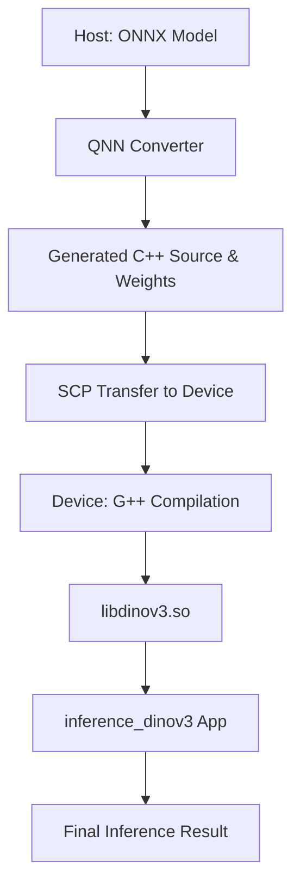

# Architecture: Dino v3 Deployment on IQ-9075

## 🏗 Workflow Overview

The deployment uses a **Dual-Stage Workflow** to overcome host-device environment mismatches.

## 🛠 Key Architecture Decisions

### 1. On-Device Compilation (The "Safe" Build)
Instead of cross-compiling on the Host (which often leads to GLIBC or ABI mismatches), we transfer the generated model source and header files to the IQ-9075 and compile the shared library (`.so`) **natively** on the target CPU.
*   **Compiler**: `g++` (Ubuntu 24.04 native)
*   **Optimization**: `-fPIC -shared` for model libraries.

### 2. Hybrid Backend Strategy
We identified a version mismatch between SDK v2.41 (Host) and Ubuntu 24.04 (Device).
*   **Bundled (v2.41)**: Used for headers and JNI wrappers.
*   **System (v2.40)**: Used for the core execution backend (`/usr/lib/libQnnCpu.so`).
This hybrid approach ensures high performance while maintaining hardware stability.

### 3. Smart Resource Management
To minimize deployment time over high-latency networks:
*   **Weight Caching**: Pre-processed weights are converted to `.o` files once and reused across deployments.
*   **Library Syncing**: SDK libraries are only uploaded if they are missing or size-mismatched on the device.

## 📁 Directory Roles (Remote)

| Folder | Content | Purpose |
| :--- | :--- | :--- |
| `bin/` | Executables | Where `inference_dinov3` and `libdinov3.so` live. |
| `src/` | Source Code | Holds `.cpp` generated by the QNN converter. |
| `obj/` | Binary Objects | Stores `weights_objs.txt` and compiled object files. |
| `lib/` | Shared Libs | Contains QNN Runtime dependencies. |
| `test/` | Data | Input `input.raw` and verification results. |

## 🧪 Verification Methodology
1.  **Preprocessing**: Image resized to 224x224, normalized, and converted to NCHW raw float32.
2.  **Load Test**: Verify model library loads into the QNN Backend.
3.  **Context Test**: Initialize hardware environment and map tensors.
4.  **Execution (Future)**: Batch execution via `qnn-net-run` for large-scale validation.
